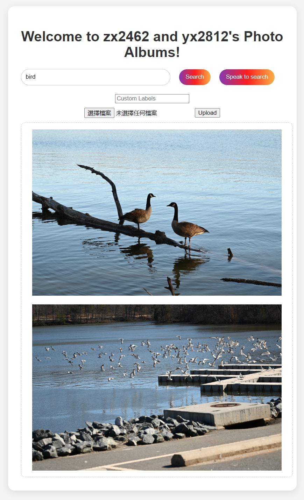

# Photo album web application

## About ##
The project is about a photo album web application that can be searched using natural language through both text and voice. We employed Lex-v2, OpenSearch, and
Rekognition to create an intelligent search layer to query your photos for people, objects, actions, landmarks.

Group members:
1. Ziang Xu, uni: zx2462
2. Yunhao Xing, uni: yx2812

S3 frontend URL:  
 - http://photos-s3-bucket-b1-6998.s3-website-us-east-1.amazonaws.com/

Checklist: 
1. Frontend code:  
   [assets/](./assets)  
   [front.html](./front.html)  
3. All Lambda Functions:
   - included in the folder: lambda functions
5. YAML file for CloudFormation:  
   [photo_album.yaml](./photo_album.yaml)  
6. A readme file containing the names and unis of you and your teammates along with the S3 frontend URL:  
   [README.md](./README.md)  

## Usage ##

1. Use any browser to open [this site](http://photos-s3-bucket-b1-6998.s3-website-us-east-1.amazonaws.com/)
2. Upload images with or without custom labels.
3. Search with the query by text or voice

